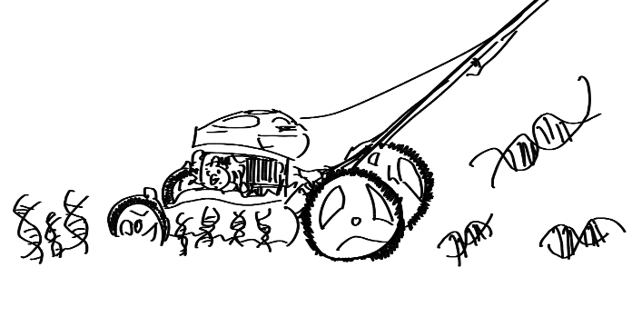
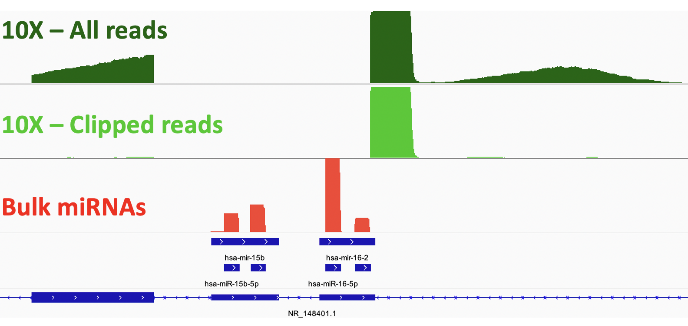

# Clippings
   
Clippings is a set of Python tools that combs through 10X Genomics scRNA-seq alignments to quantify and annotate reads that are likely to be derived from degraded or otherwise nucleolytically processed RNAs. At present, Clippings can identify two potentially useful signatures:
  
  1. RNA degradation by endonucleases, e.g. during apoptosis
  2. microRNA 3' Drosha-processing products, indicating ongoing microRNA biogenesis
  
New functionality may be added over time, including alternative TSS utilization and quantification of bona-fide transposable element transcripts, as reported by [Linker et al](https://genome.cshlp.org/content/early/2020/10/21/gr.262196.120)

## Overview

## Installation
### 1. Create a new directory and clone repository
```
(your_env) $ git clone https://github.com/jpreall/Clippings.git
(your_env) $ pip install -e Clippings
```

## Example Usage
### 1. deg_count_with_UMIs.py 
Produces a cell x gene count matrix of all truncated RNAs in the dataset. Candidate reads are first identified by the presence of a templete switch oligo (TSO), which demarcates the 5'-end of the parent molecule. Currently, the software requires a BAM alignment file generated by 10X Genomics' Cellranger pipeline version 4 or greater, which includes a 'ts:i' tag on reads containing a TSO. Reads close to annotated TSSes are filtered away, and are added to a count matrix using criteria mirroring those used by Cellranger. Uses the [Pararead](http://code.databio.org/pararead/) package to speed up counting with parallel processing. 

Outputs: Cellranger MTX-formatted matrix (barcodes.tsv.gz, features.tsv.gz, matrix.mtx.gz), HDF5-formatted matrix (raw_clipped_features_matrix.h5), and a few other ancillary outputs (dictionary.txt, jsonFolder) 
```
# Highly recommend user to submit as a job if using HPC in order to prevent over overuse of resources. This should take 5-10 minutes.
(your_env) $ python deg_count_with_UMIs.py [path_to_bam_file] --TSSgtf [path_to_gtf/genes.gtf] --cores 10 --outdir [output_folder_name] --mtx [True/False]
```

### 2. count_miRNAs.py
Counts all TSO reads aligning precisely to a predicted 3' Drosha processing site for annotated miRNAs.
Reads are counted if they contain a unique, corrected UMI-barcode pair produced by Cellranger.
Requires a GFF3-formatted miRNA annotation file downloaded from miRBase. Currently tested organisms:
* Human (GRCh38)
* Mouse (mm10)
* Fruit Fly (dm6)

```
(your_env) $ python count_miRNAs.py [path_to_bam_file] [path_to_gff3] \
  --matrix_folder [folder name] \ # Required: Cellranger Gene Expression Matrix Folder to merge with miRNA counts
  --outdir [output_folder_name] \ # Optional: Output folder to store files. Default: 'Clippings_outs'
  --write_bam_output [True/False] # Optional: write miRNA clippings to BAM file
```

This will output: 
```
  feature_bc_matrix_with_miRNAs/    # Cellranger-formatted MTX files containing miRNA clippings as additional genes
  miRNA_counts_summary.csv          # Sorted table of abundant miRNA clippings
  [SAMPLE]_sorted_miRNA_reads.bam   # BAM file containing reads annotated as miRNA clippings (eg. for viewing in IGV)
  miRNA_read_details.csv.gz         # BAM-style read-level detail in CSV format
  miRNA_count_matrix.csv.gz         # CSV-formatted cell-by-miRNA matrix
  TSO_distances_to_Drosha.csv.gz    # Summary of distances to predicted Drosha cut sit for each miRNA.  May be used in future to filter 'bogus' miRNAs
```


### 3. write_tso_bam.py
This module writes a new BAM file with only the TSO-containing reads. This might be useful if you want to take a closer look at specific genome regions or visualize them in IGV. Default output is named 'TSO_reads.bam' with accompanying index 'TSO_reads.bam.bai'.
Supports multiple CPU threads to speed up processing. 
   
```
(your_env) $ python write_tso_bam.py [path_to_bam_file] --threads [threads]
```
